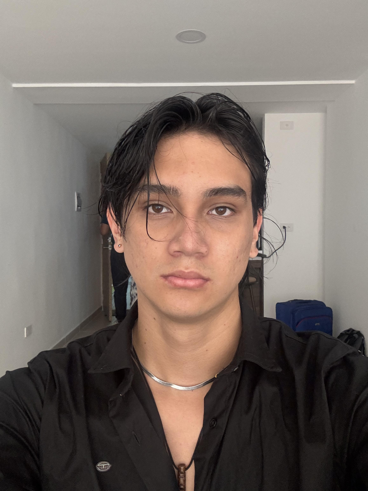

# 🚀 Mi Primera App con Laravel

  

## 👤 Sobre mí
¡Hola! Soy **Martin**, un entusiasta desarrollador en formación explorando el mundo del Backend con Laravel. 

Lo que has visto en este repositorio es el resultado de mi proceso de aprendizaje, desde la configuración del entorno (venciendo a los antivirus y configurando bases de datos) hasta el despliegue de mi primera estructura funcional.

### 🛠️ Lo que he logrado hasta ahora:
* ✅ **Instalación de Laravel:** Configuración completa del entorno PHP y Composer.
* ✅ **Base de Datos:** Implementación de migraciones iniciales con SQLite.
* ✅ **Git & GitHub:** Control de versiones y gestión de repositorios remotos.
* ✅ **Solución de Problemas:** Debugging de excepciones de servidor y manejo de llaves de encriptación (`key:generate`).

---

### 💻 Tecnologías en este proyecto:
- **Framework:** Laravel 12.x
- **Lenguaje:** PHP 8.2+
- **Base de Datos:** SQLite
- **Herramientas:** Git, Composer, VS Code

---

  <i>"El código es poesía, y yo apenas estoy escribiendo mis primeros versos."</i>

## About Laravel

